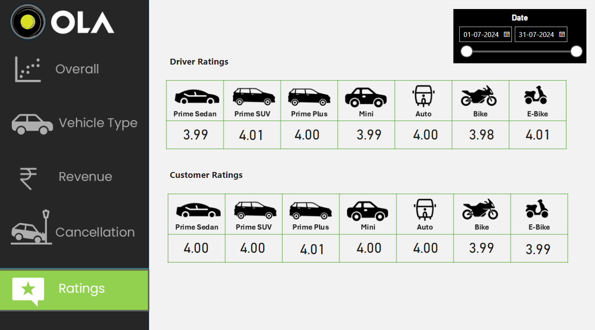

# Ola-Dashboard
The Ola Data Analytics Dashboard provides an interactive and visually appealing overview of ride data for the selected period. It is designed to help analyze key performance indicators (KPIs) and gain actionable insights into ride trends, customer behavior, and operational performance.

